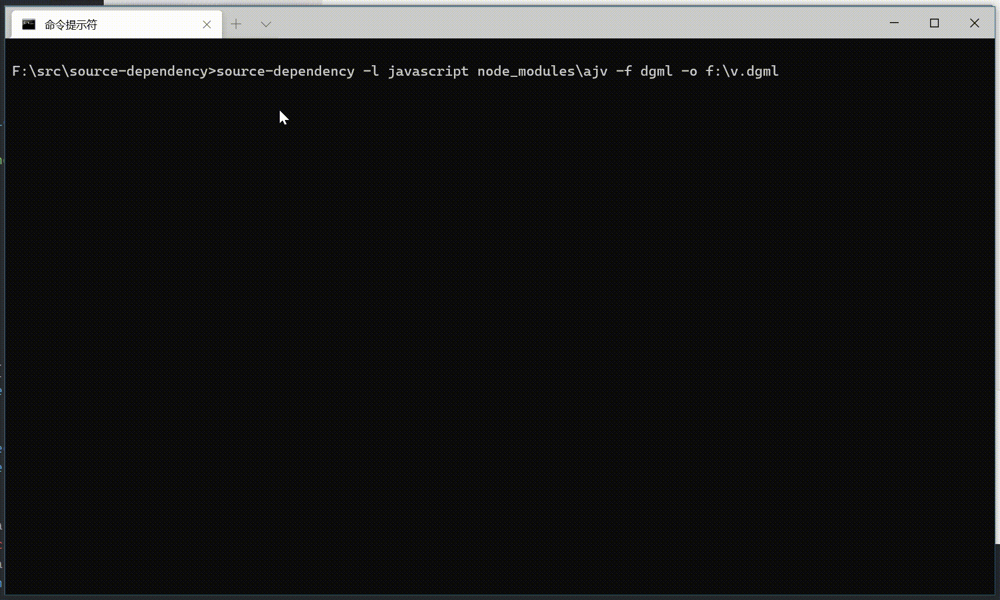
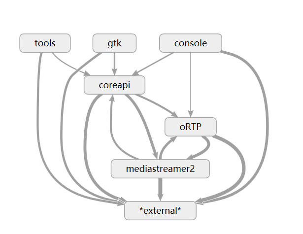
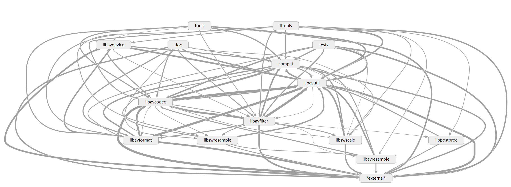
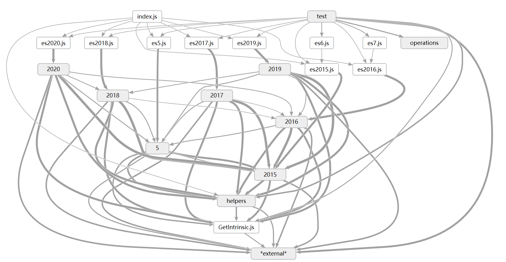

# source-dependency

A simple tool to get rough source code dependencies inside your app.

The advantage of this tool is that it has minimal dependencies, which means that you do not need to do much setup / know many tools before using it for different languages.

In the meanwhile, this tool only do lexical parsing on source file, so the result is not always very accurate.

## install

`npm install -g source-dependency`

## usage example

```bash
# output dependency and then use graphviz to visualize the dependency
source-dependency -l javascript ./node_modules/es-abstract/2015 -f dot | dot -Tsvg >~/v.svg

# check cycle dependencies
source-dependency -l java . --check

# generate dgml for better dependency walking in Visual Studio
source-dependency -l java . --strip com.my_company -E third_party -f dgml -o result.dgml

```

### usage demo



### gallary

#### linphone 3.6.1 (C)



#### ffmpeg (C)



#### es-abstract (javascript)



## road map

| feature        | description                                                  | timeline |
|----------------|--------------------------------------------------------------|----------|
| top10          | support top 10 language in TOIBE index                       | 2021 Q2  |
| top50          | support top 50 language in TOIBE index                       | 2021 Q3  |
