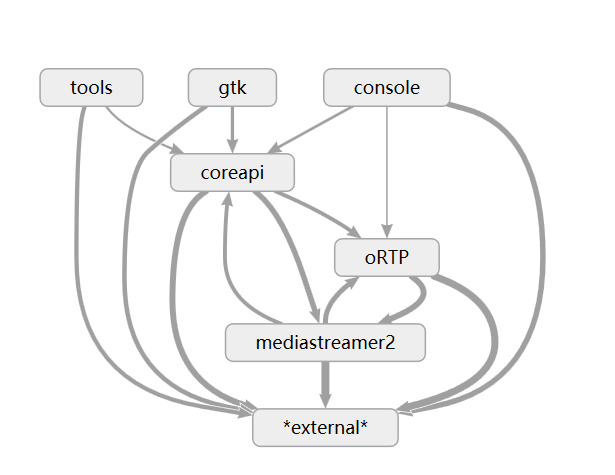
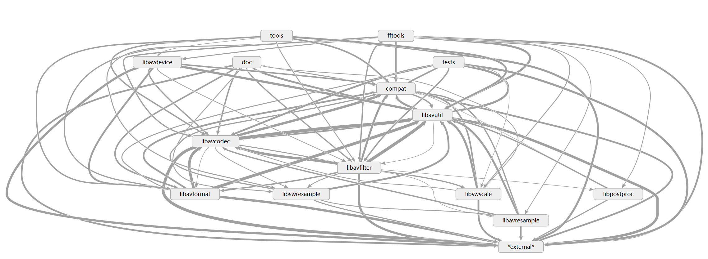
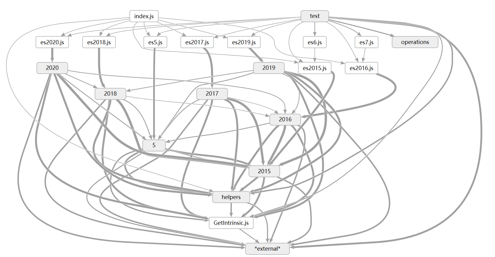
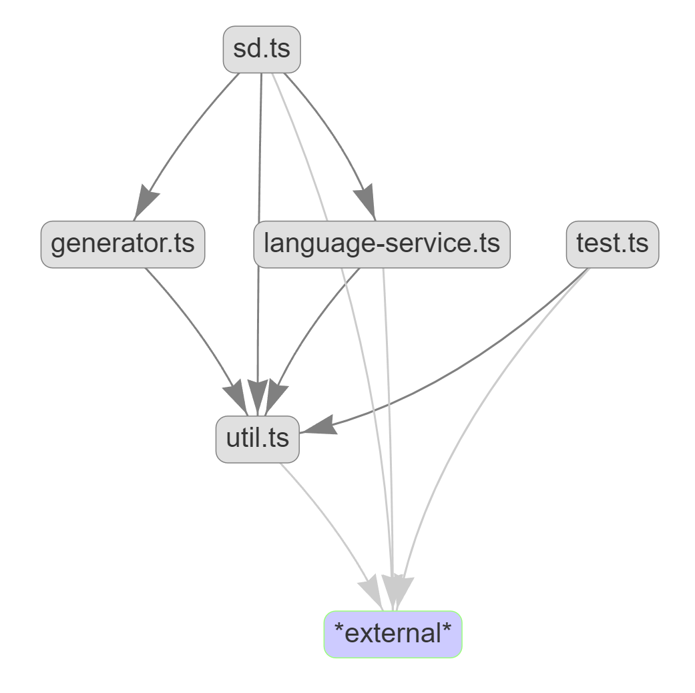

# source-dependency

A simple tool to get rough source code dependencies inside your app.

The advantage of this tool is that it has minimal dependencies, which means that you do not need to do much setup, you do not need to know many specific tools for specific language.

Of course the easy usage is achieved by sacrificing the accuracy. This tool only do lexical parsing, so won't be 100% accurate for complex constructs. However the accuracy is very good in practice, please see the gallery below for more usage examples.

The best dependency viewer is MS dgml viewer. It's only available on Windows. On Linux/Mac use dot or integrated `visjs`.

## usage

source-dependency need deno installed.

### run locally

```bash
# output dependency and then use graphviz to visualize the dependency
deno run -A sd.ts -l javascript ./node_modules/es-abstract/2015 -f dot | dot -Tsvg >~/v.svg

# check cycle dependencies
deno run -A sd.ts -l java . --check

# generate dgml for better dependency walking in Visual Studio, more config is in config.jsonc
deno run -A sd.ts -l java . -c config.jsonc -f dgml -o result.dgml

```

### run directly

deno run -A https://deno.land/x/sourcedep/sd.ts --if=-test -f dgml d:\src\myproject

### usage demo


### gallery

#### linphone 3.6.1 (VS dgml viewer)



#### ffmpeg (VS dgml viewer)



#### es-abstract (VS dgml viewer)



#### this project (visjs)



## TODOs

### BUG: C++: `#include "..."` need to resolve dependency in current directory

This can be done by changing dependencies path in the Clanguage parser

### support top 50 language in TOIBE index

welcome to send pull request to add support for any other language.
